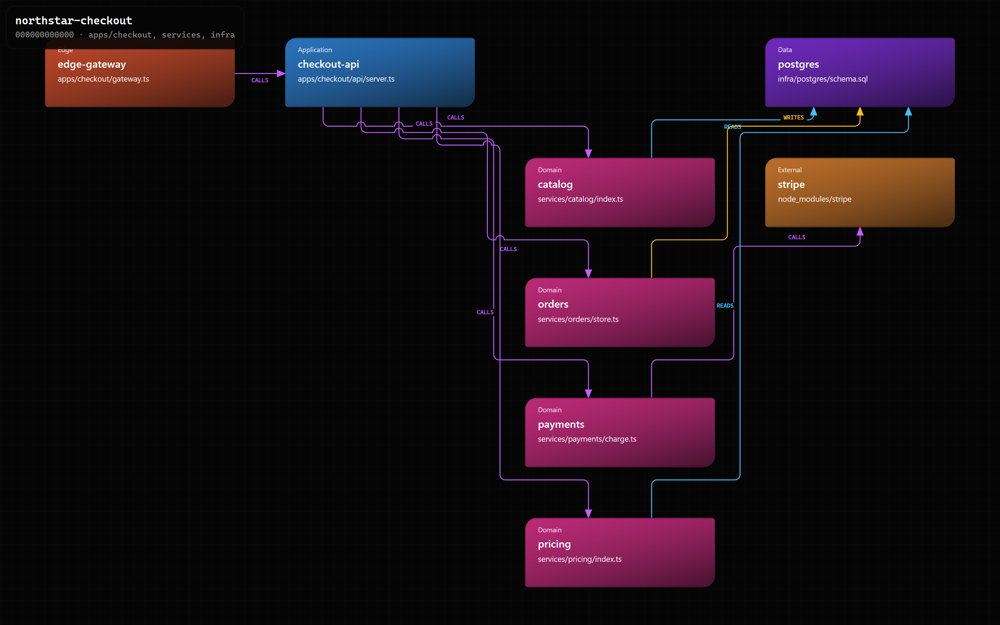
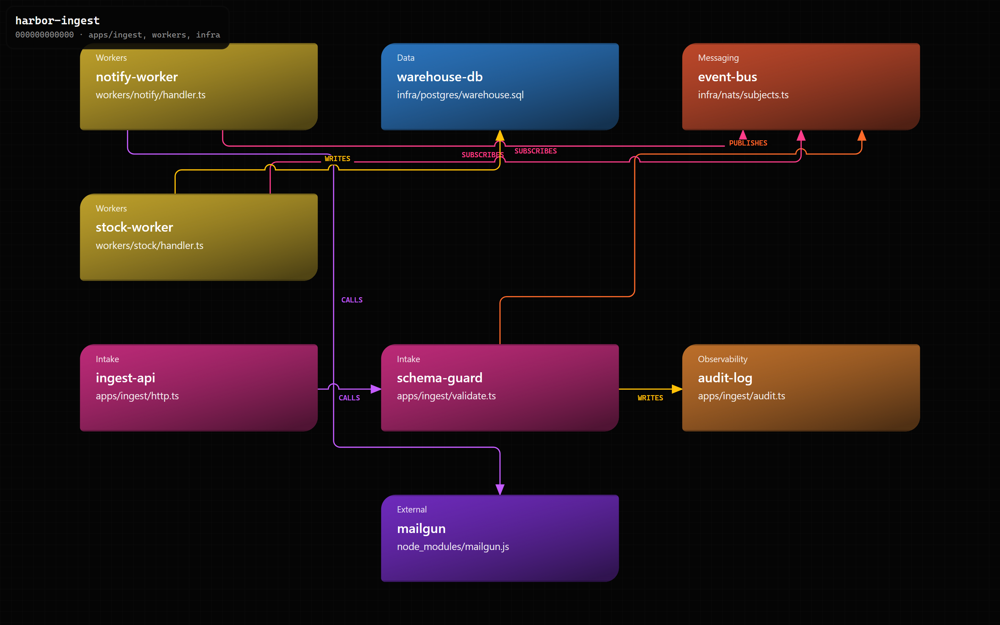
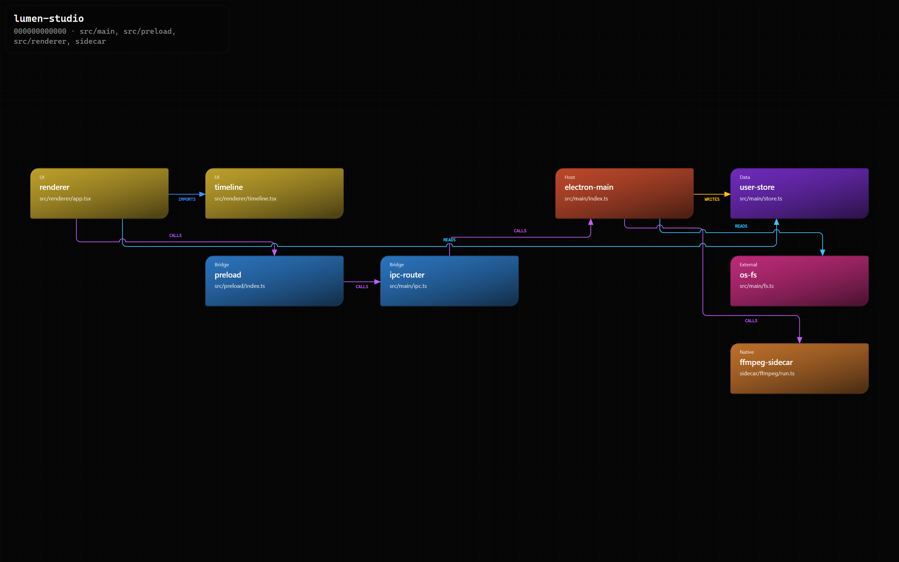
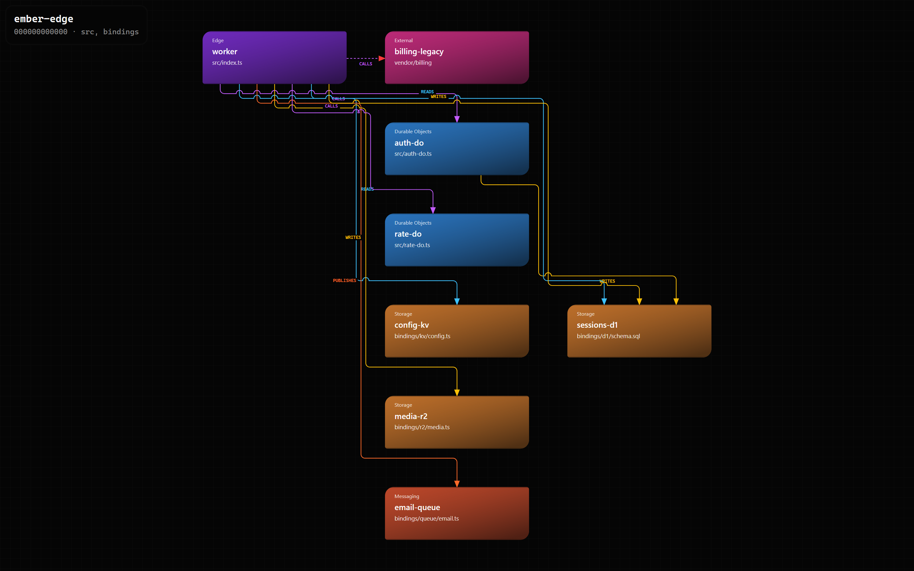

# Maintain Code Map

> A portable [Agent Skills](https://agentskills.io/) workflow that builds one evidence-backed model of a repository: JSON, Markdown, HTML, and a freshness lock.

<p align="center">
  <a href="https://github.com/gvastethecreator/code-map-skill/actions/workflows/validate.yml"></a>
  <a href="https://agentskills.io/"></a>
  <a href="https://github.com/gvastethecreator/code-map-skill/stargazers"></a>
  <a href="LICENSE"></a>
</p>

[Site](https://gvastethecreator.github.io/code-map-skill/) · [Install](#install) · [Examples](#examples) · [Use it when](#use-it-when) · [Contributing](CONTRIBUTING.md)

Agents read Markdown first. Humans open the HTML map. The lock records module fingerprints so a later agent can tell whether the map is stale before it edits product code.

The live site is [gvastethecreator.github.io/code-map-skill](https://gvastethecreator.github.io/code-map-skill/). GitHub Pages serves the `docs/` folder from `main`.

## Examples

Four fictional infrastructures. Each cell opens the live HTML map. GitHub does not run the diagram inside this README.

<table>
  <tr>
    <td align="center" valign="top" width="50%">
      <a href="https://gvastethecreator.github.io/code-map-skill/examples/checkout-api/codemap.html"></a>
      <p><b>Checkout API</b><br>Gateway, domain services, Postgres, and Stripe.</p>
    </td>
    <td align="center" valign="top" width="50%">
      <a href="https://gvastethecreator.github.io/code-map-skill/examples/event-ingest/codemap.html"></a>
      <p><b>Event ingest</b><br>Publish/subscribe workers, a queue, and side effects.</p>
    </td>
  </tr>
  <tr>
    <td align="center" valign="top" width="50%">
      <a href="https://gvastethecreator.github.io/code-map-skill/examples/desktop-studio/codemap.html"></a>
      <p><b>Desktop studio</b><br>Electron main, preload bridge, UI, and a sidecar.</p>
    </td>
    <td align="center" valign="top" width="50%">
      <a href="https://gvastethecreator.github.io/code-map-skill/examples/edge-platform/codemap.html"></a>
      <p><b>Edge platform</b><br>Worker, Durable Objects, D1/KV/R2, and one unknown hop.</p>
    </td>
  </tr>
</table>

Source JSON lives in [`examples/`](examples/). HTML copies live in [`docs/examples/`](docs/examples/). Rebuild the gallery from the skill repo:

```powershell
python scripts/build_examples.py
node scripts/capture_examples.cjs
```

## Use it when

- A repository needs a first code map under `docs/codemap/`.
- A code-changing task needs a preflight against `docs/codemap/codemap.lock`.
- Module boundaries, dependencies, routes, databases, queues, or major data flows changed.
- You need callers, callees, and impact for one module before touching it.

Do not use it to invent architecture from folder names. Unproven relationships stay `unknown`. Do not edit product code while generating the map.

## Install

```powershell
npx skills add gvastethecreator/code-map-skill --skill maintain-code-map
```

For manual project installation, copy or link `SKILLS/maintain-code-map` to the host's skill directory:

- Codex: `.agents/skills/maintain-code-map` or `~/.agents/skills/maintain-code-map`
- Claude Code: `.claude/skills/maintain-code-map` or `~/.claude/skills/maintain-code-map`
- OpenCode: `.opencode/skills/maintain-code-map` or `~/.config/opencode/skills/maintain-code-map`

After copying the complete folder, verify discovery through the host: `/skills` in Codex, `/maintain-code-map` in Claude Code, or `opencode debug skill` in OpenCode.

## Commands

Set `<skill-root>` to the installed skill directory. Artifacts land in the target repository under `docs/codemap/`.

```powershell
python <skill-root>/scripts/codemap_tool.py status --repo . --lock docs/codemap/codemap.lock

python <skill-root>/scripts/codemap_tool.py build --repo . --generated-at <utc-time>

python <skill-root>/scripts/generate_repository_map.py --repo . --output docs/codemap/.staging/codemap.json --generated-at <utc-time>

python <skill-root>/scripts/codemap_tool.py markdown --repo . --json docs/codemap/.staging/codemap.json --output docs/codemap/.staging/codemap.md

python <skill-root>/scripts/codemap_tool.py render --repo . --json docs/codemap/.staging/codemap.json --output docs/codemap/.staging/codemap.html

python <skill-root>/scripts/codemap_tool.py lock --repo . --scope . --generated-at <utc-time> --output docs/codemap/.staging/codemap.lock

python <skill-root>/scripts/codemap_tool.py validate --repo . --dir docs/codemap/.staging

python <skill-root>/scripts/codemap_tool.py publish --repo . --staging docs/codemap/.staging --target docs/codemap
```

Drive-wide inventory needs an explicit root. Pass the parent of your checkouts, not a hardcoded drive letter:

```powershell
python <skill-root>/scripts/generate_drive_maps.py --root <workspace-parent>
python <skill-root>/scripts/generate_drive_maps.py --root <workspace-parent> --write
```

Optional Chrome DevTools Protocol smoke after HTML render:

```powershell
node <skill-root>/scripts/verify_codemap_browser.cjs docs/codemap/codemap.html
```

## Package layout

- [SKILL.md](./SKILLS/maintain-code-map/SKILL.md): router, process, and command list.
- [artifact-contract.md](./SKILLS/maintain-code-map/references/artifact-contract.md): JSON, Markdown, HTML, lock, and report contracts.
- [diagram-grammar.md](./SKILLS/maintain-code-map/references/diagram-grammar.md): visual rules for the HTML view.
- [codemap_tool.py](./SKILLS/maintain-code-map/scripts/codemap_tool.py): status, build, markdown, render, lock, validate, publish, impact.
- [generate_repository_map.py](./SKILLS/maintain-code-map/scripts/generate_repository_map.py): conservative tracked-source baseline.
- [generate_drive_maps.py](./SKILLS/maintain-code-map/scripts/generate_drive_maps.py): Git-root inventory and validated batch publish.
- [evals/cases.json](./evals/cases.json): routing and safety cases.
- [examples/](./examples/): sample JSON models and local HTML maps.
- [docs/](./docs/): GitHub Pages site, example HTML copies, and gallery screenshots.

## Verify

Python 3.11+ and Git are required. Node is optional and only needed for the browser smoke script.

```powershell
python scripts/validate_package.py
python -B -m unittest SKILLS/maintain-code-map/scripts/test_codemap_tool.py
```

## License

MIT. See [LICENSE](LICENSE).

